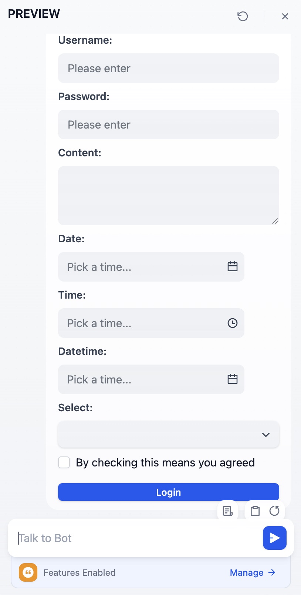

# Template

Template lets you dynamically format and combine variables from previous nodes into a single text-based output using Jinja2, a powerful templating syntax for Python. It's useful for combining data from multiple sources into a specific structure required by subsequent nodes. The simple example below shows how to assemble an article by piecing together various previous outputs:

<figure><figcaption></figcaption></figure>

Beyond naive use cases, you can create more complex templates as per Jinja's [documentation](https://jinja.palletsprojects.com/en/3.1.x/templates/) for a variety of tasks. Here's one template that structures retrieved chunks and their relevant metadata from a knowledge retrieval node into a formatted markdown:

```Plain


### Chunk {{ loop.index }}. 
### Similarity: {{ item.metadata.score | default('N/A') }}

#### {{ item.title }}

##### Content
{{ item.content | replace('\n', '\n\n') }}

---


```

<figure><figcaption></figcaption></figure>

This template node can then be used within a Chatflow to return intermediate outputs to the end user, before a LLM response is initiated.

> The `Answer` node in a Chatflow is non-terminal. It can be inserted anywhere to output responses at multiple points within the flow.

Support for rendering HTML forms

```html
<form data-format="json"> // Default to text
  <label for="username">Username:</label>
  <input type="text" name="username" />
  <label for="password">Password:</label>
  <input type="password" name="password" />
  <label for="content">Content:</label>
  <textarea name="content"></textarea>
  <label for="date">Date:</label>
  <input type="date" name="date" />
  <label for="time">Time:</label>
  <input type="time" name="time" />
  <label for="datetime">Datetime:</label>
  <input type="datetime" name="datetime" />
  <label for="select">Select:</label>
  <input type="select" name="select" data-options='["hello","world"]'/>
  <input type="checkbox" name="check" data-tip="By checking this means you agreed"/>
  <button data-size="small" data-variant="primary">Login</button>
</form>
```

<figure><figcaption></figcaption></figure>